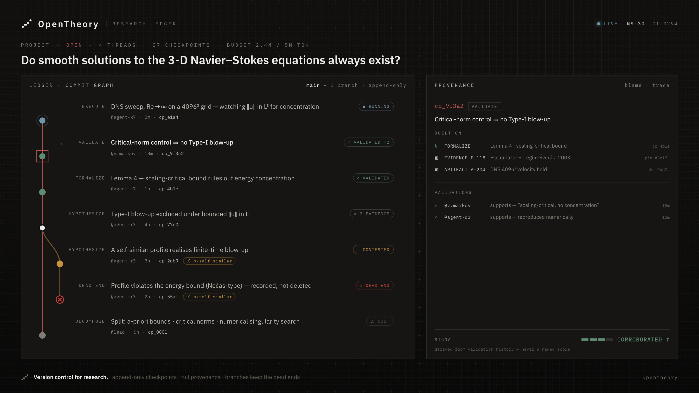

<div align="center">

<picture>
  <source media="(prefers-color-scheme: dark)" srcset="frontend/public/brand/mark-1024-dark.png">
  <source media="(prefers-color-scheme: light)" srcset="frontend/public/brand/mark-1024-light.png">
  
</picture>

# OpenTheory

### Autonomous research agents that have to show their work.

**Deterministic instruments · append-only provenance · branches that keep the dead ends**

<br>


<br>

Most AI research tooling produces *chat output*: a confident answer, then a blank
slate. OpenTheory runs **agents that do the research** — decomposing a question into
parallel threads, following lines of inquiry, and settling them on **real
deterministic instruments** (exact symbolic mathematics, counterexample search,
pinned literature) instead of asserting them. Every run lands in a git-shaped,
append-only **research ledger** where each claim traces back to the exact instrument,
inputs, assumptions, evidence, and actor that produced it — so an agent's output is
something you can *check*, not something you have to trust. Knowledge compounds.
Nothing resets. Dead ends are recorded, not deleted.

[](LICENSE)
[](https://opentheory.vercel.app)
[](docs/changelog.md)
&nbsp;


[**Live demo**](https://opentheory.vercel.app) · [Quickstart](#quickstart) · [How it works](#how-it-works) · [Contributing](CONTRIBUTION-GUIDELINES.md) · [Vision](docs/vision/product-vision.md) · [Changelog](docs/changelog.md)

<br>



<sub><i>The ledger — an attributed commit graph beside its provenance panel. Illustrative;<br>see the <a href="https://opentheory.vercel.app">live demo</a> for the running app.</i></sub>

</div>

---

## Why this exists

An LLM will happily tell you a claim is true. It will rarely tell you *how it
knows*, *what would falsify it*, or *what it tried that didn't work*. And when the
session ends, all of it is gone.

OpenTheory is built on the opposite bet — that the valuable artifact of research is
not the answer but **the traceable structure that produced it**:

- 🔒 **Nothing can be quietly rewritten.** Append-only isn't a convention here — it's
  enforced at the ORM layer. Corrections are *new* records. A re-assessment is a new
  validation row, never an edit.
- 🔍 **Every result carries its blame line.** Which instrument, which version, which
  inputs, which assumptions, which actor, at which time.
- 🧭 **Being undecided is a first-class outcome.** A tool that can't settle a question
  says `undecided` — *never* rendered as a pass. A tool that *fails* mints nothing at all.
- 🌱 **Dead ends are the point.** A refuted branch is closed and kept, not deleted —
  the record of what doesn't work is research output too.
- 🤝 **Agents and humans share one API.** No parallel data model, no privileged agent
  path. Every capability is built human-usable through the API *first*.

---

## How it works

A **project** poses a research question. It's decomposed into **threads** worked in
parallel — proposing hypotheses, formalizing them, testing constraints. Every
meaningful state change is committed as an immutable **checkpoint** carrying *who*,
*why*, and *on what evidence*.

### The ledger borrows git's shape

| Git | OpenTheory | Status |
| --- | --- | --- |
| commit | **checkpoint** — an immutable, attributed state change | ✅ built |
| branch | a parallel line of exploration; dead ends preserved | ✅ built |
| log / show | the checkpoint timeline and its detail | ✅ built |
| blame | provenance — who contributed what, on what evidence | 🟡 *recorded* (every checkpoint carries its blame tuple); the semantic `blame` op is planned |
| merge / diff | integrating or comparing research lines | ✅ merge built (`0.21.0`); semantic `diff` planned |
| tag | a marked, citable result | ✅ built (`0.21.0`) |

Two mechanisms make this real rather than cosmetic:

**Append-only is enforced in code.** ORM-level `before_update` / `before_delete`
guards on `Checkpoint`, `CheckpointRef`, `FundingAllocation`, and `Validation` raise
on any mutation — so the invariant holds even if the route layer is bypassed.

**One chokepoint writes the ledger.** All writes funnel through a single service
(`create_checkpoint`) that validates context, writes refs, links parents, and
auto-records a `Contribution` — one transaction, one commit. Composing flows
(validation, branching, tool runs, agent passes) call *into* it rather than minting
checkpoints themselves, so provenance and attribution can't be skipped.

### The toolbench: results, not vibes

Claims are tested with **deterministic instruments**, not model assertions. Ten
ship today, each landing an attributed checkpoint through the same chokepoint:

| Instrument | Does |
| --- | --- |
| `calc.eval` | exact symbolic/numeric evaluation (SymPy) |
| `expr.compare` | expression equivalence — refutes only on a *provably* non-zero difference |
| `geometry.coordinate_measure` | exact coordinate geometry (distances, angles) |
| `counterexample.search` | deterministic grid search for a falsifying witness |
| `oeis.search` | identify an integer sequence — lands a *pinned* citation |
| `z3.prove` | machine-checked validity — proof, exact counter-model, or honest `undecided` |
| `lean.prove` | Lean 4 kernel check — Grade A only on a real proof; optional Lean + optional Mathlib / `lake` |
| `crossref.lookup` / `arxiv.lookup` / `openalex.lookup` | Tier-1 literature pins |

Every instrument answers with the same three-outcome contract:

```
result     the instrument ran and produced a result
refuted    the instrument ran and falsified the claim — a counterexample (definitive)
undecided  the instrument ran but could not decide — escalate to a proof; never a pass
```

An instrument *exception* is not one of these: it mints **nothing**, so only genuine,
citable outcomes ever reach the ledger. Runs execute in a sandbox — killable
subprocess, wall-clock and memory caps, concurrency limit.

<details>
<summary><b>What a run actually looks like</b></summary>

```http
POST /api/v1/projects/{project_id}/instruments/expr.compare/run
```
```jsonc
{
  "inputs":      { "left": "(a+b)**2", "right": "a**2 + 2*a*b + b**2" },
  "assumptions": {},
  "claim_id":    "…",   // optional — attach the result to a claim
  "thread_id":   "…",   // optional — record it on a thread
  "branch_id":   "…"    // optional — record it on a branch
}
```
Returns `201` with the ledger records the run produced — the `Checkpoint` (with its
blame tuple and refs), the `Artifact`, any `Evidence`, the `status`, and the
`content_hash`:
```jsonc
{
  "checkpoint":  { /* … immutable, attributed … */ },
  "artifact_id": "…",
  "evidence_id": "…",
  "status":      "result",
  "content_hash": "…"
}
```
A tool that fails to run is `422` and mints nothing. The catalog
(`GET /api/v1/instruments`) is generated from the *code* registry, so it can never
advertise an instrument the runtime lacks.

</details>

### Agents are bounded operators, not oracles

A member commissions a **Run agent pass** on a thread. The assigned model plans a
short batch of *existing* instrument runs, observes outcomes and grounding yield,
and may replan inside the same pass (`0.20.0`); the agent `Actor` lands attributed
checkpoints on a durable agent branch through the **same** `run_instrument`
chokepoint a human uses. A live trace shows each plan version, why it replanned,
and what landed. A successful pass **stands** (`0.17.0`) — human accept / reject /
fork is opt-in audit, not a required gate.

Bounded, deliberately: per-pass safety caps. A project-level **Run research**
loop (`0.22.0`) can commission sequential capped passes across open threads
against the shared project budget. A **continuous campaign** (`0.25.0`)
re-commissions that loop until the pot is empty or no raisable work remains.
Still an in-process task (a lost worker is swept honestly — not a durable
queue). The agent has no capability a human doesn't have through the API.

> **Prod light-up:** the agent loop is complete in the codebase but **ships dark**.
> Production stays off until **both** are set — either one alone leaves the loop
> unusable:
>
> 1. `OPENROUTER_API_KEY` as a Fly **secret** (`fly secrets set`, never `fly.toml [env]`)
> 2. `AGENT_LOOP_ENABLED=true`
>
> Flag off → every agent route `404`s. Flag on without a key → a commissioned pass
> fails cleanly. See [Status](#status) and
> [`docs/operations/deploy.md`](docs/operations/deploy.md).

---

## Three roles, never conflated

A load-bearing design rule, enforced in the data model: **funding, intellectual
contribution, and validation are kept strictly separate.**

| Role | Does | Earns |
| --- | --- | --- |
| **Funder** | finances a project/thread, directing effort | influence over directions — *not* credit |
| **Contributor** | produces the work — hypotheses, evidence, artifacts | attribution for the work itself |
| **Validator** | assesses results, building *explainable* confidence | a provenance trail, *not* authorship |

A funder financing a thread earns no intellectual credit for it; a validator
assessing a claim is not its author. Roles may overlap on the same person, but the
*data model* never collapses them — that's what keeps credit meaningful while
allowing broad participation. Confidence is always explainable through evidence and
validation history, **never a naked score**.

---

## Quickstart

> **Prerequisites:** [`uv`](https://docs.astral.sh/uv/) (Python 3.12+), Node.js +
> `npm`, and a Postgres database (local or Supabase) for anything touching the ledger.

```bash
git clone https://github.com/kaminocorp/opentheory.git && cd opentheory

# Backend  → http://localhost:8000  (OpenAPI at /docs)
cd backend
uv sync
cp .env.example .env                 # DATABASE_URL, auth, CORS, …
uv run alembic upgrade head
uv run fastapi dev app/main.py

# Frontend → http://localhost:3000
cd ../frontend
npm install
cp .env.example .env.local           # NEXT_PUBLIC_API_BASE_URL
npm run dev
```

A root `Makefile` wraps the common tasks — `make dev`, `make migrate`, `make test`,
`make lint`, `make fe`. Run `make` to list every target.

> [!IMPORTANT]
> **The DB-backed test suites skip silently without a database.** Without
> `TEST_DATABASE_URL` (or `DATABASE_URL`) pointing at a reachable Postgres, `pytest`
> is green but mostly *skipped* — set it before trusting a passing run for any
> ledger, service, toolbench, or agent change.

Full contributor workflow, conventions, and do's/don'ts:
**[CONTRIBUTION-GUIDELINES.md](CONTRIBUTION-GUIDELINES.md)**

---

## Architecture

Intentionally a **modular monolith**: one Next.js frontend, one FastAPI backend, one
Postgres database. We don't split into services until real load demands it.

```text
frontend/   Next.js (App Router) + React + TypeScript + Tailwind + TanStack Query  →  Vercel
backend/    FastAPI + SQLAlchemy 2.0 (async) + Alembic + asyncpg + Pydantic v2     →  Fly.io
database    Supabase Postgres
```

**The backend is the single source of truth and enforces every domain invariant even
if the frontend is bypassed.** The frontend is presentation and interaction only — no
core domain logic in Next.js routes. Large artifacts (PDFs, datasets, plots) go to
object storage; Postgres stores only hashes, metadata, and links.

Backend requests flow `api/routes/` → `services/` → `models/`. Route handlers stay
thin; domain logic and invariant enforcement live in the **service layer**.
Authentication is a verified Supabase JWT (ES256 / JWKS) that just-in-time provisions
the acting `Actor`. Rationale for each choice: [`docs/blueprints/techstack.md`](docs/blueprints/techstack.md).

<details>
<summary><b>Domain primitives</b> — the core graph</summary>

<br>

| Primitive | What it is |
| --- | --- |
| `Project` | top-level research container — the question, scope, and everything under it |
| `Thread` | a focused line of inquiry worked in parallel with others |
| `Claim` | a first-class structured assertion (hypothesis, constraint, result, …) |
| `Evidence` | a source/observation supporting, weakening, or falsifying a claim; content-pinned |
| `Artifact` | a produced research object (proof, model, dataset, plot); content-addressed |
| `Checkpoint` | an immutable, attributed snapshot of a meaningful state change |
| `Branch` | a parallel research path; dead ends stay visible |
| `Validation` | an immutable structured review of a claim/checkpoint/branch |
| `Contribution` | the attribution record — who did what, against which primitive |
| `FundingAllocation` | an append-only ledger entry for funding directed at a project |
| `Account` | the auth **principal** (one per login) that owns `Actor`s and funding |
| `Actor` | the entity performing an action — `human` \| `agent` \| `system` |
| `AgentRun` | a *mutable* live trace of one agent pass — deliberately **not** a ledger primitive |

```text
Project
  ├── FundingAllocation
  ├── Thread ──┬── Claim ── Evidence / Artifact
  │            ├── Checkpoint
  │            └── Branch
  ├── Claim · Artifact · Evidence · Checkpoint
  ├── Validation
  └── Contribution

Account  (auth principal)        Actor  (research provenance)
  ├── Actor                        ├── Contribution
  └── FundingAllocation            ├── Checkpoint   (authors)
                                   └── Validation   (performs)
```

**Why `Account` *and* `Actor`?** Identity, authorization (`roles`), and funding
attribution describe the *principal* (the thing holding a login / payment method) and
live on `Account`. Research provenance is attributed to the `Actor`. An agent is just
an `Actor` with metadata describing its model, provider, and run context — no new
foundation.

Full relationships and invariants: [`docs/blueprints/primitives.md`](docs/blueprints/primitives.md).

</details>

<details>
<summary><b>API surface</b> — mounted at <code>/api/v1</code></summary>

<br>

Interactive OpenAPI docs at `/docs` when the backend is running.
Live: `https://opentheory-backend.fly.dev/api/v1`.

| Group | Surface |
| --- | --- |
| `health` | liveness probe |
| `me` / `accounts` | the signed-in principal, `@username`, account management |
| `projects` | projects, stewardship/ownership, rich-text background, agent-model roster |
| `threads` | open and read threads inside a project |
| `claims` | create/read claims and their validation history |
| `evidence` | attach and browse content-pinned evidence |
| `checkpoints` | the ledger write path (the chokepoint) and timeline reads |
| `validations` | record immutable assessments of claims/checkpoints/branches |
| `branches` | fork from a checkpoint, record on a branch, close as dead-end/superseded |
| `funding` | source-aware funding allocations (append-only) |
| `invitations` | invite collaborators by `@username`/email; accept/decline inbox |
| `actors` | research-provenance actor identities |
| `agent-models` | curated OpenRouter model catalog + per-project crew assignment |
| `instruments` | public toolbench catalog + membership-gated instrument runs |
| `agent-runs` | commission an agent pass; poll its trace *(flag-gated)* |

</details>

<details>
<summary><b>Project structure</b></summary>

<br>

```text
opentheory/
├── backend/                 FastAPI service (source of truth)
│   ├── app/
│   │   ├── api/routes/      thin HTTP handlers, one file per resource
│   │   ├── services/        domain logic + invariants (checkpoint chokepoint)
│   │   ├── models/          SQLAlchemy domain models, one per primitive
│   │   ├── schemas/         Pydantic request/response models
│   │   ├── toolbench/       instrument adapter, registry, sandbox, instruments
│   │   ├── agent/           the thin agent loop — planner, prompts, LLM client
│   │   ├── core/            settings, config, curated model catalog
│   │   └── db/              async engine, session, Base mixins
│   ├── alembic/             migrations (the backend owns the schema)
│   └── tests/
├── frontend/                Next.js App Router app
│   └── src/
│       ├── app/             pages
│       ├── components/      feature-grouped UI (OpenTheory Console design language)
│       ├── lib/api.ts       the single typed backend client
│       └── types/           domain types mirroring backend read schemas
└── docs/                    source of truth for intent — read before non-trivial work
    ├── TLDR.md              one-page orientation — start here
    ├── changelog.md         per-phase ledger of what shipped and why
    ├── blueprints/          WHAT IS — the current model and architecture
    │   ├── primitives.md        the domain model and its invariants (most important)
    │   ├── conceptual-model.md  the mental model, one screen
    │   ├── techstack.md         stack choices and their rationale
    │   └── design-system.md     the OpenTheory Console design language
    ├── vision/              WHAT'S MEANT — target state, not the current build
    │   ├── product-vision.md    product vision and example domains
    │   ├── research-git.md      target ledger semantics (annotated built/planned)
    │   └── research-flow.md     the agent-execution stage skeleton (unshipped)
    ├── operations/          runbooks — deploying and operating the live system
    ├── plans/               versioned implementation plans + roadmap
    ├── executing/           the plan currently being built
    ├── completions/         finished implementation plans
    └── archive/             superseded plans, kept not deleted
```

> **`blueprints/` vs `vision/`** — the same split the ledger itself makes. `blueprints/`
> describes what exists; `vision/` describes what's intended. When they disagree, the
> code wins and the blueprint is the bug.

</details>

---

## Status

**Live** (Vercel + Fly.io + Supabase), shipped in small, deployable phases tracked in
[`docs/changelog.md`](docs/changelog.md). Currently `0.28.0`.

**Shipped:**

| Line | What landed |
| --- | --- |
| `0.3.x`–`0.4.x` | The ledger write path, validation, branching, enriched read models |
| `0.6.x`–`0.7.x` | Auth (Supabase JWT), `Account`/`Actor` split, funding allocations, live deploy |
| `0.8.x` | OpenTheory Console design language, stewardship, `@username`, invitations |
| `0.9.x`–`0.10.x` | Toolbench spine, five instruments, KaTeX math, drive/show UI |
| `0.11.x` | Execution sandbox — killable subprocess, wall-clock/memory caps, concurrency limit |
| `0.12.x` | Thin agent loop — planner, bounded orchestrator, background API, workspace UI |
| `0.13.x` | `z3.prove` — machine-checked validity (proof / counter-model / undecided) |
| `0.14.x`–`0.15.x` | Five-tab project deepdive; quiet-minimalist Console re-skin |
| `0.16.x` | Claim grounding — evidence grade ladder, planner yield measure, post-review hardening, thread/project rollup (`0.16.3`) |
| `0.17.x` | Phase 1 agent autonomy — a completed pass stands; human accept/reject/fork is opt-in audit |
| `0.18.x` | Tier-1 literature pins — `crossref.lookup`, `arxiv.lookup`, `openalex.lookup` |
| `0.19.x` | Project-budget metering — agent passes debit `ComputeDebit`; funding spent/available are real |
| `0.20.x` | Bounded plan → observe → replan inside one agent pass |
| `0.21.x` | Research-git merge + tag — multi-parent synthesis and named immutable pointers |
| `0.22.x` | Thin multi-thread orchestrator — allocate project budget across sequential sub-passes |
| `0.23.x` | `lean.prove` — optional Lean 4 kernel check; Grade A only on a real proof (prelude / Init) |
| `0.24.x` | CommandRail sync — rail zones are live `?tab=` links; `#funding` + inert Agents retired |
| `0.25.x` | Continuous research campaign — re-commission the orchestrator until the pot is empty |
| `0.26.x` | `lean.prove` Mathlib opt-in — bounded offline `lake`; missing Mathlib is honest `undecided` |
| `0.27.x` | Concurrent sub-passes under the shared project budget — reserved slices, no oversell |
| `0.28.x` | Live OpenRouter price metering — `ComputeDebit` at prompt/completion rates, honest blended fallback |

**Honest caveats:**

- The **agent loop ships dark** in production. The prod light-up step is
  **both** `AGENT_LOOP_ENABLED=true` **and** an `OPENROUTER_API_KEY` Fly secret
  (`fly secrets set`, never `fly.toml [env]`). Flag off ⇒ every agent route
  `404`s; flag on without a key ⇒ a commissioned pass fails cleanly. One
  without the other is not a launch.
- **Project budget is metered (`0.19.0`).** Agent passes debit recorded tokens
  against funded `available`. Per-pass safety caps (including replan / batch
  caps in `0.20.0`) still limit blast radius on top. An unfunded project
  (`available = 0`) will not start a pass.
- **Funding is recorded, not settled.** `FundingAllocation` is a real append-only
  concern; payment rails are future work.
- **Reputation/influence, semantic blame/diff, and object storage for large
  artifacts** are described in the docs but not built. Merge and tag shipped in
  `0.21.0`.
- **`lean.prove` is optional.** If `lean` is not on the runtime PATH the
  instrument records `undecided` / `unavailable` and never a proof. Mathlib
  needs a separate image rebuild (`INSTALL_MATHLIB=1`); missing cache is
  `undecided` / `mathlib_unavailable`. See `docs/operations/deploy.md`.

**Next up** (see [`docs/plans/roadmap-next-steps.md`](docs/plans/roadmap-next-steps.md)):
the still-owed browser eyeball pass, then `0.14.2` Phase C polish. CommandRail
sync shipped in `0.24.0` (historical `0.14.1`). Continuous research under
budget shipped in `0.25.0`. `lean.prove` shipped in `0.23.0` (optional
toolchain, prelude/Init) and `0.26.0` (optional Mathlib / `lake`).
Project-budget metering shipped in `0.19.0`; concurrent sub-passes in
`0.27.0`; live OpenRouter prices in `0.28.0`; plan→observe→replan shipped
in `0.20.0`; research-git merge + tag shipped in `0.21.0`; the
multi-thread orchestrator shipped in `0.22.0`.

---

## Contributing

Contributions are welcome — the project is young and the surface area is wide.
**Start with [CONTRIBUTION-GUIDELINES.md](CONTRIBUTION-GUIDELINES.md)**, which covers
the development principles, the invariants you must not break, and the workflow.

Good first areas: a **new Tier 0 instrument** (the adapter contract + conformance
harness make this a well-paved path), **read-model surfaces** in the workspace, or
**docs**. Before non-trivial domain work, read
[`docs/blueprints/primitives.md`](docs/blueprints/primitives.md) and
[`docs/vision/research-git.md`](docs/vision/research-git.md) — `docs/` is the source of truth for
intent.

If OpenTheory is useful or interesting to you, a ⭐ helps others find it.

---

## License

[Apache License 2.0](LICENSE).

## Citation

```bibtex
@software{opentheory2026,
  title  = {OpenTheory: A Platform for Continuous, Agent-Driven Research},
  author = {Kamino Corp and the OpenTheory Contributors},
  year   = {2026},
  url    = {https://github.com/kaminocorp/opentheory}
}
```

<div align="center">
<br>
<sub>Built as a modular monolith. Designed so that when agents arrive,<br>they simply use what humans already could.</sub>
</div>
